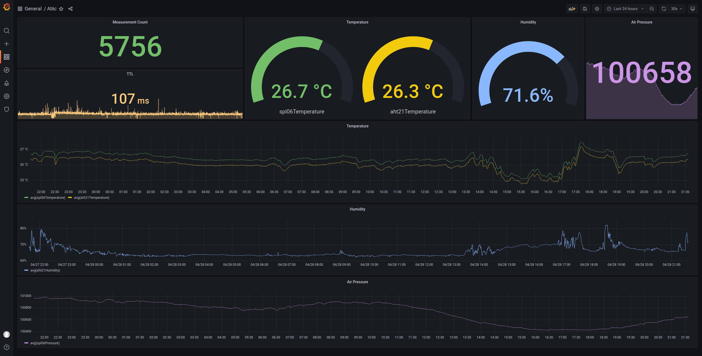

Sourcekit&reg; Atiic is an universal i2c to serial bridge. Atiic means AT commands to operate i2c devices. Check [i2c.ninja](https://i2c.ninja/#/about) to see how its AT command sets work.

PC - USB - USB-TTL - Atiic - i2c sensors (SPL06 and AHT21)

# Instructions

1. Flash an micro SD card with latest [64-bit Raspberry OS Lite](https://downloads.raspberrypi.org/raspios_lite_arm64/images/raspios_lite_arm64-2022-04-07/2022-04-04-raspios-bullseye-arm64-lite.img.xz) and get it running, Raspberry Pi 3B (RAM 1GB) should be enough in this application.

2. Install docker, reference: https://docs.docker.com/engine/install/debian/

    1. sudo usermod -a -G docker pi
    2. append `cgroup_enable=memory` in `/boot/cmdline.txt`
    3. system reboot

3. Install grafana-oss

    1. sudo mkdir -p /var/lib/grafana /var/lib/atiic
    2. sudo chown 472 /var/lib/grafana  
    3. docker run -d -p 3000:3000 -v /var/lib/grafana:/var/lib/grafana -v /var/lib/atiic:/var/lib/atiic:ro --name=grafana --restart=unless-stopped grafana/grafana-oss:8.5.0

4. Install aguegu/Atiic

  docker run -d --name=atiic --restart=unless-stopped --privileged=true -v /var/lib/atiic:/var/lib/atiic -v /dev:/dev -v /run/udev:/run/udev:ro aguegu/atiic:develop-arm64v8

5. Configure grafana

    1. Visit http://<raspberrypi ip>:3000 and login with admin/admin
    2. In menu `Server Admin / Plugins` install `sqlite`
    3. Configure a SQLite datasource, and click `Save & Test`
        * Name: Atiic
        * Path: /var/lib/atiic/database.SQLite
    4. Go to menu `Dashboards` and create an new Dashboard
    5. Create a dashboard with SQL:
    ```
    SELECT avg(aht21Humidity), max(ts) as _ts FROM atiic WHERE ts >= ${__from:date:seconds} AND ts < ${__to:date:seconds} group by (1000*ts/$__interval_ms)
    ```

6. Tweak the dashboard to the style you prefer

  

  There are 6 fields in the `atiic` table:

  * ts: INTEGER PRIMARY KEY, unix timestamp in seconds
  * spl06Temperature: REAL, Temperature reading from SPL06, unit Celsius (&deg;C)
  * spl06Pressure: REAL, Air Pressure reading from SPL06, unit Pascal (Pa)
  * aht21Temperature: REAL, Temperature reading from AHT21, unit Celsius (&deg;C)
  * aht21Humidity: REAL, Relative Humidity reading from AHT21, unit 100%
  * ttl: INTEGER, measurement duration,  unit milliseconds (ms)
