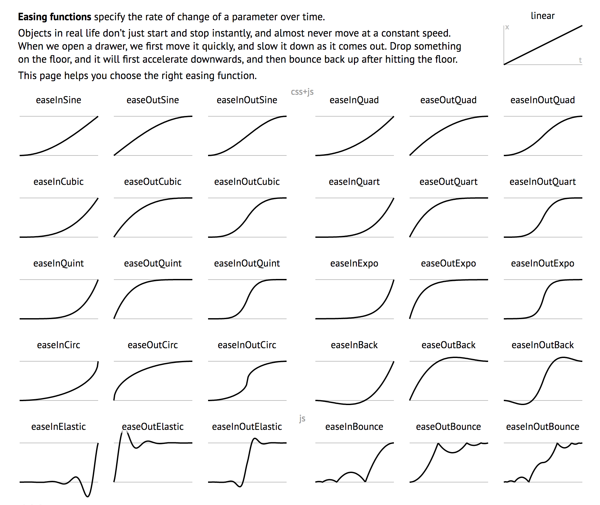

## Hello, otto

[otto](https://www.ottodiy.com/) 是个可爱的 [Arduino](https://www.arduino.cc/) 开源双足教育机器人项目。寒假前，福州哈雷创客空间的朋友找到我说希望整个 [micro:bit(mbt)](http://microbit.org/) 的冬令营，本来想说之前做的[RC车](https://aguegu.github.io/post/rc-car-microbit/)换个玩具车的底盘就能上了，结果被嫌弃说车子满大街，而且希望小朋友们能多学点东西，体现一点逼格。后来找来找去，发现 otto 还是比较合适。因为扯到动作的话，可以说是无底洞，够玩很久的。好吧，那就 otto 吧。

## 框架设计

接下活儿，就发现原来还是个不小的坑。因为主控还是 micro:bit，金手指部分的 IO 口其实少得可怜，除去鳄鱼夹口、按键、LED、i2c、SPI以后，只有 P8、P16 可用。还有 IDE 部分，makecode 在浏览器里拖来拖去感觉是很方便，但是也确实太占地方了……超过三层的嵌套看过去就是很大一坨了，而且传参数部分还有分行处理，平常一行的代码也会变得一大坨。写库的话，如果是这样，大家平时看不到，还是可以忍受，但是来小朋友来玩就不太合适了。

库的部分，也是不看不知道，一看吓一跳。内容其实也是很多，那最简单的舵机转至特定角度来说，本质是保持一个特定占空比的脉冲输出。在火车扳道这类的动作中，比较直接，只要一条指令就可以了，然后 PWM 保持住就可以了。而在机器人则全然不是这么一回事。这里有了速度的概念，在 5 秒和在 0.5 秒内从 0 度到 90 度，对于机器人来说，是完全不同的两个概念，前者可以实现一个金鸡独立的动作，而后者则会因为动作太快直接倒地。这里就出现了`动作帧`的概念。毕竟模拟舵机的命令周期是 25ms。那么基本就是每 25ms 有一个动作帧。一个 5 秒的连续动作，拆分成 5000 / 25 = 200 帧。

于是代码分为三层：1）最底层：保持 PWM 信号；2）中间层：拆分动作帧并发送至最底层；3）业务层：动作业务逻辑，发送到中间层。这里对于 mbt 以及 mbed 就有很多问题：

* PWM 口不足，其实也有看到实现了三只舵机驱动的版本。
* 哪怕通过 PCA9685 扩展 PWM 口，中间层感觉在 mbt 上感觉也不太容易实现，一方面：这部分有实时性很高，而 mbt 在接口部分已经经过了层层封装，而且看起来用的还是“高级语言”。
* 如果 microbit 这么忙的话，对于蓝牙连接等会不会有比较大的影响？

想来想去，还是觉得把底下两层外移，引入一块舵机板来解决问题。好在 mbt 的串口能转发到金手指上。至于舵机板呢？那就自己开发好了，反正手也痒了很久了。

micro:bit --串口--> 舵机板（STM32） --i2c--> PCA9685 --> 舵机

数据流向大概就是这样，在 mbt 上只要实现动作的业务指令，剩下的事情都交给底层去作好了。舵机驱动这一层，暂时是用到了 PCA9685 作为 PWM 芯片，好处是支持多路扩展，一片就能支持16路PWM，能支持62片，而且配置简单；缺点是“理论精度”不够。相信在下一个版本中，就会取消 PCA9685，改由 STM32 的 PWM 直接驱动，毕竟作为 otto 来说，基本款只需要4只舵机，哪怕再加2只胳膊，也不过是6只舵机而已，48脚的 STM32 就能胜任了。

使用串口作为舵机板的接口，是有很多好处的，和很久以前作的 3D8 光立方一样，最主要的作用就是支持各种控制平台，串口不处不在，各种单片机、PC都能有串口数据，而PC上各种语言，基本也都有串口的库方便调用。在机器人，尤其是偏“舞蹈”方向的机器人，会让调试变得很容易，如果编辑好动作，主要将同样的逻辑在“生产环境”上移植就好。毕竟各个舵机如何配合、转多少度、快慢、怎么转，在PC上调试都容易很多，避免了单片机重复烧写的麻烦。

### 舵机板设计

舵机板主控芯片采用最平民的[STM32F103C8T6](http://www.st.com/en/microcontrollers/stm32f103c8.html)。包含以下几个功能：

* 舵机驱动：PCA9685 （以后会改为 PWM 直驱），PCB上预留8路，实际使用4路；
* EEPROM：用于存储舵机校准数据；
* 异步串口指令接口；

为什么要异步呢？首先，现在大部分新一点单片机的串口硬件层面都支持全双工通讯，也就是发送和接收可以同时进行。上游发来的指令，其实不用等下游响应，可以一口气一直发，提高命令发送频率；而作为响应，因为响应的通道是独立的，只要指令执行完了，就可以把响应报文放入响应队列（接收的数据也是往队列里塞）。发送报文和接收报文之间的对应关系，通过某个自增的id进行对应就可以了。这样的方式，其实也是向下兼容半双工/单工的方式的。上位机在发送报文之前，清空接收的缓存。在发送报文之后，等待同样id的响应报文出现就可以了。

* 标准 USART 和 USB-CDC 双串口设计；

标准 USART 作为与 mbt 的连接，自然必不可少。有了它，就能通过 USB 转串口FTDI设备（FT232, CP210X, PL2303, CH340）等也能实现 USB 接口与 PC 连接。但是，既然 STM32F103 上提供了 USB2.0 接口，又何必闲着呢，CDC 驱动基本就是将设备模拟成串口设备了，是 USB 接口最基本的应用之一。软件部分还是当串口设备来连，也不需要引入特别的驱动程序（其实主要是因为还不会……），各个操作系统都能直接用，还是很不错哒。

* 动作帧自动生成；

把这部分功能接到舵机板这边实现，上位机的指令在驱动板上得到分解。这样，上位机只需要在下一个动作需要执行的时候，再发送下一个动作的指令即可。这样上位机的运算负担能减轻很多。动作的流程变为：“用1秒时间来匀速抬腿”->"延时1秒，用以等待动作完成"->“再用1秒时间来匀速收腿”->"再延时1秒，用以等待动作完成"。从命令角度来说，就成为“发送串口指令-延时等待”、“再发送串口指令-再延时等待”这样的模式。在 mbt 这样的开发环境下，由于有 [MBed](https://www.mbed.com/) 这样实时操作系统的加持，所谓的延时，也会用去跑别的任务（线程），反而是释放系统资源的好事。

* 独立的舵机控制通道；

在讲解`异步`的部分已经提到，上位机发送指令不需要等待，而可以连续发送，如果上位机发送了一条“10秒内，将0号舵机匀速移动至180度”的指令，那么在未来的10秒中，如果没有其它针对0号舵机的指令出现，那么它就一直按计划进行动作，因为这条命令已经发送完了，那么上位机可以继续发送1号、2号、3号舵机的指令，有的在0.5秒内完成，有的3秒完成。指令应该互不干扰，只有面向同样目标的指令才会

## otto 底层驱动分析

otto 那么多的代码，其实在这次设计中最关注的`舵机控制`的部分，是玩舵机类制作难得的学习资料。

其实各种动作，无非是4路舵机驱动指令的组合。而对于单路舵机的控制命令，只有2种：`平动`（moveTo）和`摆动`（oscillate）。同时执行的多路指令，无非是将单路指令进行组合就是。但是，由于它们占用同样的时间长度。所以，otto原生驱动目前只能做到4路舵机`同时`平动或`同时`摆动。这就让有些动作变得比较奇怪了，比如迈步走。而由于我的舵机板实现了独立舵机通道和动作帧自动生成，所以就能实现在同一时间内，某些舵机是在作平动，有些是在摆动，动作会更`规范`一些。

### 平动 moveTo

这是最基础的控制指令，参数有3个：`舵机号`、`目标角度`和`时间(ms)`。可以读成：将多少毫秒内将某号舵机移动至某角度。

这个指令，其实并不关心当前舵机的角度，也就是说它只关注终点而不关心起点，起点是由上一条指令决定的。这是原生驱动的做法。

在我的舵机板内，由于使用“命令-延时”的模式，既然命令中已经包含了时间参数，那么“理论上”，上位机应该遵守这个约定，给舵机板以足够的时间来执行动作，时间只多不少，再执行下一步指令。但舵机板其实不纠结的，如果延时没有给够，新的指令就来了，那么，舵机板就会以收到命令时刻的舵机角度作为起点，使用新的时间参数和目标角度，重新计算动作帧，旧指令自动作废。比方说，舵机当前在90度，然后执行平动命令“2000ms内到达0度”，舵机开始往0度位置开始移动，在1000ms以后，舵机还未到达90度，只是在45度的位置，此时突然接到新的命令“在1000ms内到达180度”，那么此时舵机就会将0度的老目标抛在脑后，开始执行到180度的指令，关注终点，而不关注起点。

* Easing 支持

不会 CSS 的 Python 工程师，不是好的嵌入式开发工程师。

[Easing](http://easings.net/)是[CSS](https://developer.mozilla.org/en-US/docs/Web/CSS)的一个函数子集。主要用于微调 CSS 动画的变化方式（轨迹）。除了默认标准的匀速运动（Linear），还有很多诸如“快入慢出”、“慢入快出”、“慢入慢出”、“快入快出”等操作。至于快慢怎么定义，其实还是有很多标准的曲线作为参考，如`正弦`，`平方`、`指数`等等。

所以舵机板支持的移动曲线，除了标准的匀速运动（Linear），还支持多种设置。以 BounceOut 为例，其意义为以“弹跳”的方式“出”，在下图的视频中，舵机臂从 20 度至 160 度的时候，采用 BounceOut 方式，再以同样的方式，从 160 度回到 20 度。


<video width="480" controls>
  <source src="bounceout.mp4" type="video/mp4">
</video>


能够这样配置，可以让既定的动作增加很多细节，用的还是原来的目标角度和时间。帅气～

### 摆动 oscillate

otto 的驱动部分最让我惊艳到的就是摆动函数。以正弦函数为基础，摆动函数实现的是舵机的周期性摆动。原生驱动中包含：A（Amplitude 幅度）, O（Offset 起始偏移）, T（Time 周期）, phase_diff（相位角偏移）四个参数。

* T (Time 周期)，定义和平动参数中的时间一样，都是给完成动作设定时间。不同的是，当动作完成时，平动到达目标角度，而摆动是回到起始角度（摆过去后，又摆回来），相当于 x 轴上 2 * pi 的长度。

* A（Amplitude 幅度），正弦曲线所在圆的半径，因此最大值与最小值之间的差值是A的2倍。不过由于我们的配置目标也是舵机臂的角度，所以这个参数的单位也是`度`。

* O (Offset 起始偏移)，默认是0，也就是舵机臂90度的位置。假设 phase_diff 也是默认值0，而A幅度值为20°。那么在一个周期内，舵机的摆动轨迹是：90° - 110° - 90° - 70° - 90°。如果起始偏移 Offset 设为 -30°，那么舵机的摆动轨迹是：60° - 80° - 60° - 40° - 60°。有个整体的偏移。

* phase_diff（相位角偏移），是最难理解的部分。在默认值0的情况下，是从sin曲线的 0° 作为起点，那么摆动轨迹（A=20°）为 90° - 110° - 90° - 70° - 90°，是一个先升后降再升的规律。而如果相位角偏移为 90，那么sin曲线周期是从 90° 位置开始计算来完成这样一个周期，这样舵机运动对轨迹就变成了：90° - 70° - 50° - 70° - 90°，是一个先降后升的规律。这样就能实现单向的摆动。

(未完待续)
