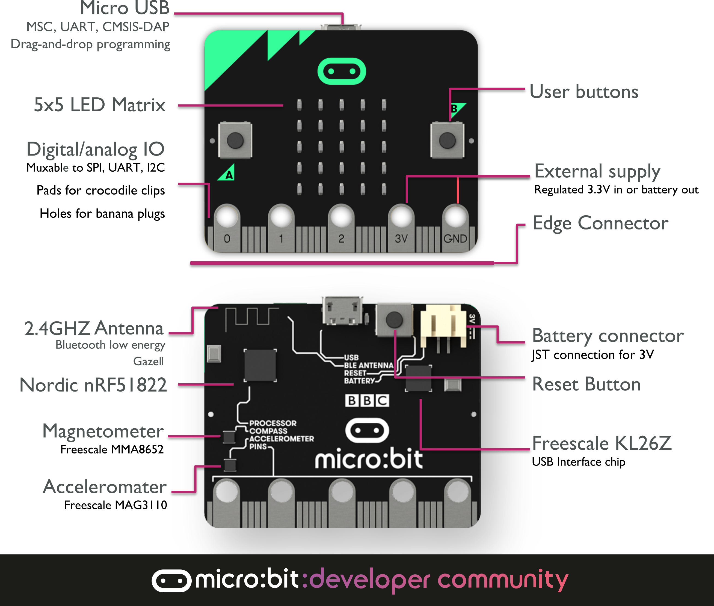
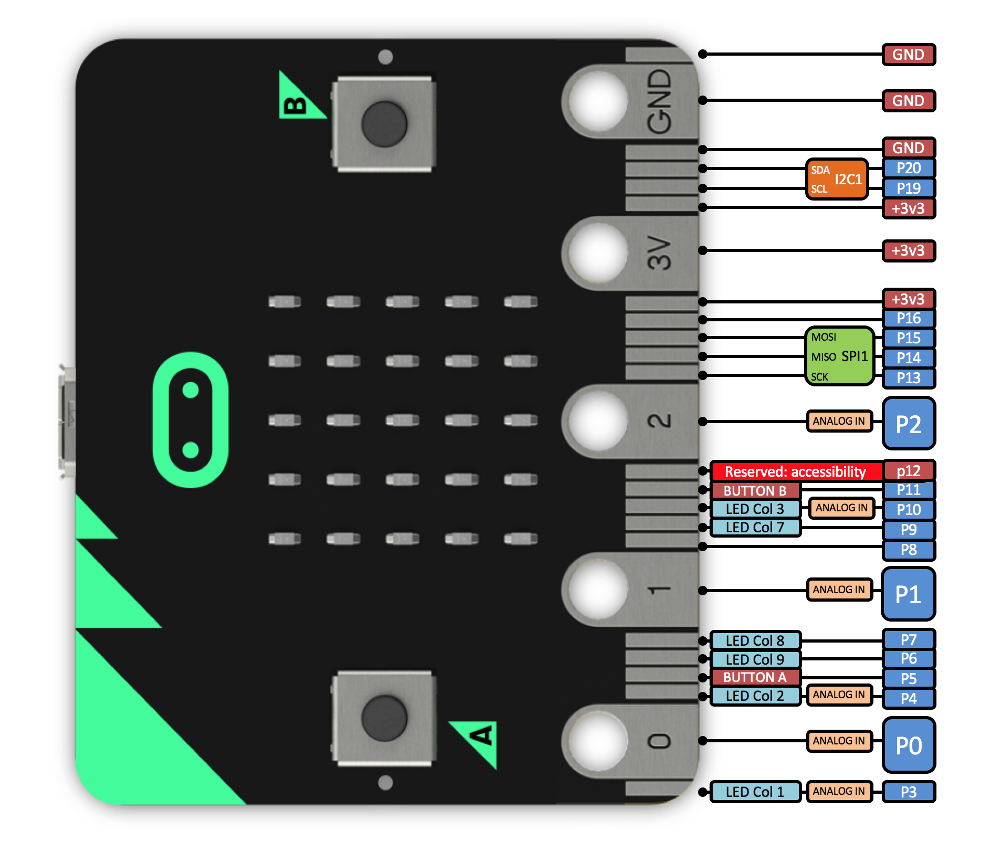

### 认识 micro:bit

The purpose of [micro:bit](https://www.microbit.co.uk) is to encourage kids to learn how computers work, rather than simply consuming media on them.

这句关于 micro:bit 原理的介绍说得太好了，以至于直接把英文引用过来。micro:bit 的目的，是鼓励孩子们去学习计算机是如何工作的，而非仅仅消费计算机提供各种媒体。“消费”这个词用得很妙，计算机走进人们的生活，样子早不是原先的大块头，笔记本、手机、手表、电视等等。计算机真是无处不在，而我们在使用它的同时，正一步步沦为了“消费者”。真的是在“消费”呢，上面的内容那么丰富，各种游戏、视频、娱乐，应接不暇，消费都消费来不及呢。而 micro:bit 的期望，是希望新生代们对计算机的认识，不仅仅局限于“消费”，而更多的是在“研究”或是“学习”。有点像我早期开始玩电脑的阶段，虽然最终目的，可能也是为了更爽的“消费”，但软硬件各种知识也学了不少，现在能靠这个混饭吃，很大程度上归功于当年打下的基础。而如今，都快物联网了，各类计算机设备那么多，集成度越来越高，功能越来越强大，交互越来越“傻瓜”，新一代人可能再也无法体验想当年那种，一台电脑配置单研究几个月，硬件装一天，系统再装半天，然后，为了各种驱动还要不断折腾的年代了。

 <!--more-->

micro:bit 的前途不可限量，尤其实在教育领域，一方面，BBC 将向英国所有11-12岁学生免费发放，作到人手一片，一下就奠定了庞大的用户基础，另一方面，BBC还合作了包括Microsoft、ARM Holding、Lancaster University、Samsung 等组织机构共同开发 micro:bit 的生态，有“正规军”的投入，也让应用体系很快就健全起来，而且看上去还有“高上大”的感觉。

## Layout

micro:bit 集成的传感器、按键和 5x5 LED点阵，都是亮点。传感器包括：加速度计、磁力计，而主芯片又是蓝牙SoC，主芯片内部还提供了温度计。LED点阵还提供了，光强度的测量。

这里很值得一提的是副芯片：KL26Z，这块芯片在 micro:bit 上的功能十分重要，一方面，提供了类似优盘的USB接口，这就让几乎所有操作系统都能即插即用。而通过将 hex 文件拖拽到“优盘”内，就能实现主芯片程序的烧录。同时，这个芯片还提供了串口的接入，在PC上进行串口通讯也不需要额外的串口模块。而且，主芯片的主电源3.3v，在连接USB的情况下，也是由这块芯片提供。

IO脚的部分，虽然从数量上来看并不是很多，但是常用的 i2c、SPI接口也有引出，还是具备一定的扩展性的。金手指的设计，是方便小朋友们使用鳄鱼夹来进行外设的连接，不过可以看到电源两侧窄的金手指，也同样是电源，某种程度上能避免了一些短路情况的发生，还是颇费心思的。

引脚部分，除了 P0/P1/P2，功能比较独立，然后就只有 P8/P16 能作简单的 IO 输出。发挥空间并不是很多。同时，也没有引出5V，看了使用2节干电池供电是micro:bit的主要应用场景。

## 开发环境

正是由于那么多“大厂”的加入，micro:bit的开发环境多种多样，也提供多种语言的支持。

* [https://makecode.microbit.org](https://makecode.microbit.org)
  * 积木式，多语言支持，javascript，Microsoft
* [https://www.microbit.co.uk/app](https://www.microbit.co.uk/app)
  * Javascript (Code Kingdoms)
  * Block Editor (Microsoft)
  * Touch Develop (Microsoft)
  * Micro Python (The Python Software Foundation)
* [https://os.mbed.com/compiler](https://os.mbed.com/compiler) (Mbed, C++)
* [yotta](https://www.mbed.com/en/platform/software/mbed-yotta/) (Mbed, C++, offline)

## 开发示例

### Hello, world.

<iframe style="position:absolute;top:0;left:0;width:100%;height:100%;" src="https://makecode.microbit.org/#pub:_YsAYcj7XXdzA" frameborder="0" sandbox="allow-popups allow-forms allow-scripts allow-same-origin"></iframe>

运行这个示例，需要连一个小扬声器到 Pin#0 和 GND，让人惊喜的是，makecode 上直接集成了一些简单的音效，直接就可以选择播放。This is a big surprise. 如果想用 Arduino 实现同样的功能，肯定没有这么简单，旋律以什么样的方式呈现在代码中，都是很抽象的事情，而 makecode 开发环境还能直接展示模拟的效果，真的是可以一下子就让小朋友们爱不释手。

### Bluetooth Services

<iframe style="position:absolute;top:0;left:0;width:100%;height:100%;" src="https://makecode.microbit.org/#pub:_JK3FYzJHwbmo" frameborder="0" sandbox="allow-popups allow-forms allow-scripts allow-same-origin"></iframe>

配合应用市场上已有的 app，很方便就能体验 micro:bit 上的蓝牙服务。

这里开启的几个服务：加速度计、磁力计、温度计、LED、按键，通过 app 都能访问互动：

这里推荐：[micro:bit blue](https://play.google.com/store/apps/details?id=com.bluetooth.mwoolley.microbitbledemo)

### RC Car

在 micro:bit blue 应用中，有一个游戏手柄的应用，这个是 micro:bit 非常吸引我的地方，而在以往的经验中，想作遥控车子，就要同时开发小车端和遥控端，如果还要移动端的话，还要折腾移动应用开发，一想就是头很大的事情。而 micro:bit blue / bitty controller 上已经提供了手柄应用的话，那么基本就只有小车端要开发了。而且，使用蓝牙还有个天然优势，就是配对的支持，这就可以同时跑多辆车，而不用担心干扰的问题。

<iframe style="position:absolute;top:0;left:0;width:100%;height:100%;" src="https://makecode.microbit.org/#pub:_3b47DW4oAg8q" frameborder="0" sandbox="allow-popups allow-forms allow-scripts allow-same-origin"></iframe>

就像之前扬声器播放旋律的示例一样，原先在其它平台比较复杂的应用，到 micro:bit 这边已经非常简化了。我一开始也以为控制小车，各种信号事件处理会很复杂，然而并没有……

原来 makecode 中已经集成了与手柄应用配对的各种事件，那么接下来的操作就很简单了，只要把相应了IO执行代码嵌入进去就行了，而IO操作的外设也只有2个：舵机1个，电机1个。舵机有三种状态：左中右，电机有三种状态：进停退。舵机只需要1条控制线；电机的话，通过电机控制模块，也只占2个IO口。电源部分比较纠结，车架上有个2个串联的AAA(7号)电池位。如果单纯使用3v供电，舵机力量不足，角度不到位，后使用2节3.2v磷酸铁锂电池（配合占位筒）并联，并升压至 4.2v 进行供电。



## 相关模块：

* [电机控制模块](https://item.taobao.com/item.htm?id=542991756965)
* [电源模块](https://item.taobao.com/item.htm?id=558424285462)

## 感谢

* [圣源智造](https://shop168218288.taobao.com) 作为硬件合作伙伴，硬件部分的设计都是交给他的，技术棒棒哒～
* [福州哈雷创客空间](http://hlmaker.com/) 本文的主要是 2017年11月24日 在哈雷创客空间进行的 micro:bit 分享会，我作为主讲人之一，将我所分享的内容整理，希望有更多的线下活动组织起来。
* [purplepalmdash.github.io](https://purplepalmdash.github.io) 我的 Hugo 引路人

## 参考资料

* [micro:bit 电路图](https://github.com/bbcmicrobit/hardware/blob/master/SCH_BBC-Microbit_V1.3B.pdf)
* [Bitty Apps](http://www.bittysoftware.com/apps.html)
* [MakeCode solution source code - bitty controller]( http://www.bittysoftware.com/tutorials/bitty_controller_makecode.html#makecode)
* [makecode RC car](https://makecode.microbit.org/projects/rc-car)
